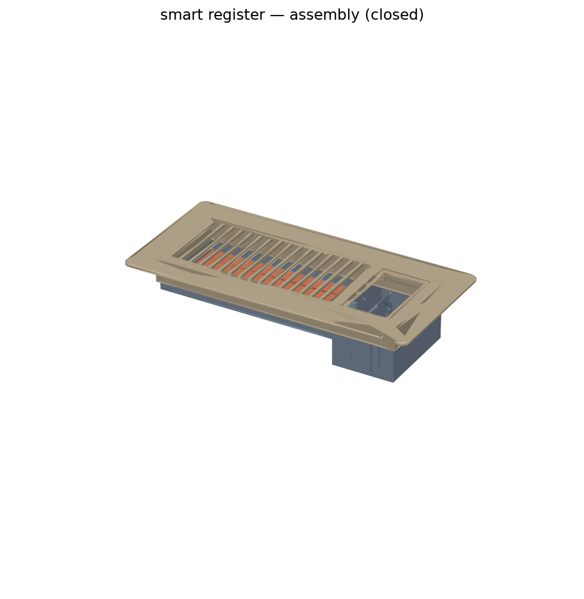
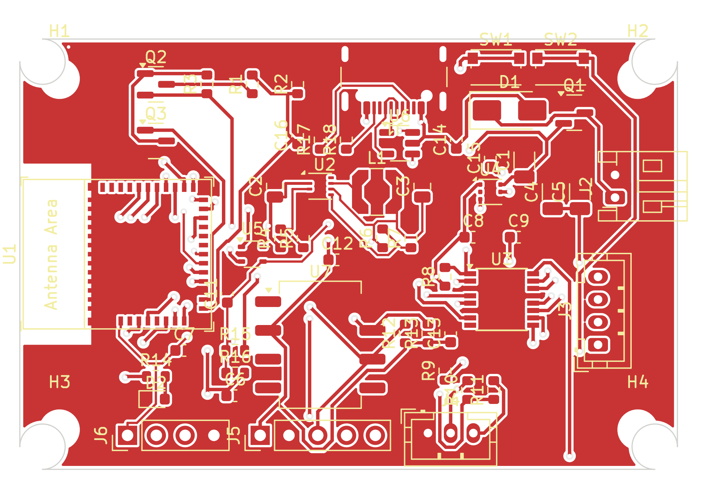
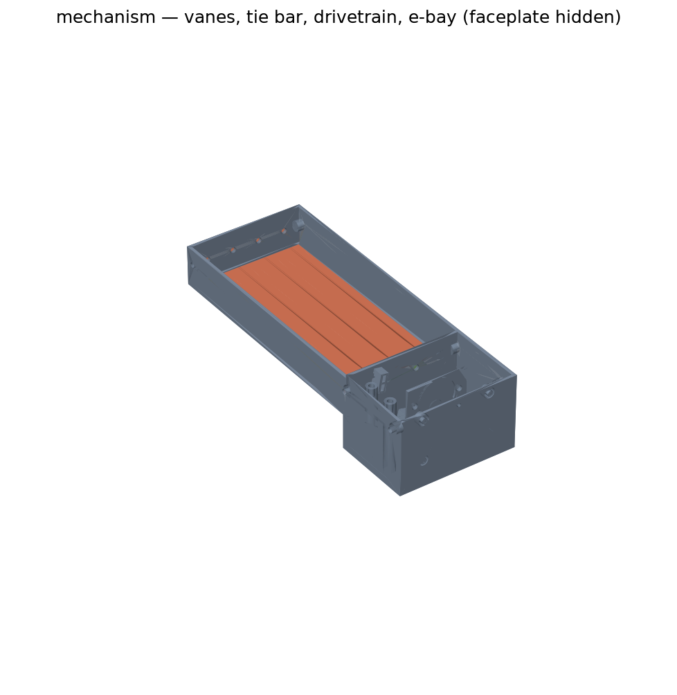

# OpenRegister — Zigbee Smart HVAC Register

A battery-powered, drop-in smart floor register for **room-by-room temperature
control** with Home Assistant. Replaces a standard 4"×10" floor register with a
3D-printed unit containing a stepper-driven damper, limit switches, a
differential-pressure fail-safe, and a Zigbee radio that runs 1–2+ years on
4× AA lithium cells.

```
Wall temp sensor ──► Home Assistant ──► Zigbee ──► register damper position
                          ▲                              │
                          └──── pressure / battery ◄─────┘
```



| PCB rev A (front) | Mechanism (faceplate hidden) |
|---|---|
|  |  |

## Highlights

- **Zigbee sleepy end device** (ESP32-C6) — pairs with Zigbee2MQTT or ZHA and
  appears in Home Assistant as a `cover` entity with a position slider.
- **Fine-grained damper control** — 28BYJ-48 geared stepper (bipolar-modified,
  DRV8833 driver) with limit switches for homing; motor fully de-energized
  between moves.
- **Autonomous pressure fail-safe** — an onboard differential pressure sensor
  trips the damper fully open if duct static pressure exceeds a threshold,
  with **no network dependency**; an HA-side blueprint additionally keeps the
  total open area across all registers above a configurable floor.
- **Ultra-low power** — ~150 µA average draw ⇒ ≈2.4 years on 4× AA lithium
  (see [docs/power-budget.md](docs/power-budget.md)).
- **Fully parametric CAD** — the whole register is generated from one
  parameters dataclass ([build123d](https://build123d.readthedocs.io/)), so
  other register sizes are a preset away.

## Repository layout

| Path | Contents |
|---|---|
| [`docs/`](docs/) | Architecture, power budget, BOM, assembly, pairing guides |
| [`firmware/`](firmware/) | ESP-IDF + esp-zigbee-sdk firmware (C) with host-runnable unit tests |
| [`hardware/pcb/`](hardware/pcb/) | KiCad schematic + layout, fab outputs |
| [`cad/`](cad/) | build123d parametric models, STL/STEP export, pytest checks |
| [`homeassistant/`](homeassistant/) | Zigbee2MQTT converter, ZHA quirk, HA blueprints |

## Getting started

1. **Read** [docs/architecture.md](docs/architecture.md) for the system design.
2. **Buy** the parts in [docs/bom.md](docs/bom.md).
3. **Print** the register: `cd cad && pip install -e . && python export.py`
   then print the STLs in `cad/out/stl/` ([docs/assembly.md](docs/assembly.md)).
4. **Flash** the firmware: `cd firmware && idf.py set-target esp32c6 && idf.py flash`.
5. **Pair** with Zigbee2MQTT and import the blueprints
   ([docs/pairing-setup.md](docs/pairing-setup.md)).

## Status

Rev A — design complete, hardware validation in progress. Firmware bring-up
happens on an ESP32-C6-DevKitC-1 with breakout boards **before** ordering the
custom PCB; see the dev-bench section of the BOM.

## License

MIT — see [LICENSE](LICENSE).
