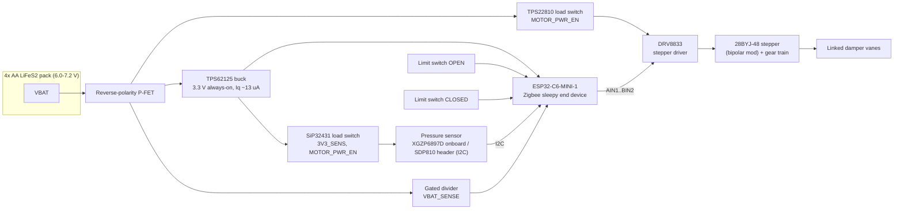

# System Architecture

Battery-powered Zigbee smart register: a drop-in 4"×10" floor register with a
stepper-actuated multi-vane damper, limit switches, differential-pressure
fail-safe, and a ~2-year battery life on 4× AA lithium (LiFeS2) cells.

## Block diagram



Two power domains:

- **Always-on 3.3 V** (TPS62125): the ESP32-C6 and nothing else. The buck's
  ~13 µA quiescent current plus the C6 in light sleep sets the sleep floor.
- **Switched VBAT "VMOT"** (TPS22810, `MOTOR_PWR_EN`): DRV8833 stepper
  driver. (TPS22919/SiP32431-class switches are 5.5 V-max parts — below the
  7.2 V fresh pack — hence the 18 V-rated TPS22810 here.)
- **Switched 3.3 V "3V3_SENS"** (SiP32431 from the 3.3 V rail, same
  `MOTOR_PWR_EN` signal): pressure sensor + I2C pull-ups. Energized only
  during moves and pressure samples; parked leakage ≤ 1 µA total.

The pressure sensor has two mutually exclusive fit options: XGZP6897D
directly on board (cost-down default) or an SDP810 connected to the 5-pin
remote-sensor header (premium accuracy; also mechanically flexible for tube
routing).

## Pin map

Single source of truth — `firmware/main/board.h` mirrors this table and is
selected per-board with `idf.py menuconfig` (Kconfig choice `BOARD_*`).

| Signal | Rev A GPIO | DevKitC-1 GPIO | Dir | Notes |
|---|---|---|---|---|
| `VBAT_SENSE` | 0 | 0 | AI | ADC1_CH0, 1 M / 330 k divider |
| `VBAT_SENSE_EN` | 1 | 1 | O | High = divider connected (NFET → P-FET) |
| `MOTOR_AIN1` | 2 | 2 | O | DRV8833 AIN1 |
| `MOTOR_AIN2` | 3 | 3 | O | DRV8833 AIN2 |
| `MOTOR_BIN1` | 4 | 4 | O | DRV8833 BIN1 |
| `MOTOR_BIN2` | 5 | 5 | O | DRV8833 BIN2 |
| `I2C_SDA` | 6 | 6 | IO | Pressure sensor bus (on switched rail) |
| `I2C_SCL` | 7 | 7 | O | |
| `BOOT_BTN` | 9 | 9 | I | Boot strap; long-press = factory reset / pair |
| `USB_D-` / `USB_D+` | 12 / 13 | (USB conn) | IO | USB-Serial-JTAG flash/debug |
| `UART_TX` / `UART_RX` | 16 / 17 | 16 / 17 | O/I | Debug header |
| `LIMIT_OPEN` | 18 | 18 | I | Closes to GND at full-open travel |
| `LIMIT_CLOSED` | 19 | 19 | I | Closes to GND at full-closed travel |
| `STATUS_LED` | 20 | 8 (onboard) | O | Identify blink, fault codes |
| `MOTOR_PWR_EN` | 21 | 21 | O | Load-switch EN, high = motor + sensor rails powered |
| `LIMIT_SENSE_EN` | 22 | 22 | O | Sources the limit-switch pull-ups during moves only |
| `SENS_IRQ` (spare) | 23 | 23 | I | Reserved on the remote-sensor header |

> GPIO10/11 are **not bonded out** on the ESP32-C6-MINI-1 module — do not
> assign them. Free for future use: GPIO14, GPIO15.

Limit switches are wired switch→GND on the input side with their pull-up side
fed from `LIMIT_SENSE_EN`, so there is **zero standby current** through the
switch network; inputs are only meaningful while the CPU is awake and moving
the motor (no GPIO wake needed).

## Zigbee device model

Sleepy End Device (`rx_on_when_idle = false`), one application endpoint.

Manufacturer **"OpenRegister"**, model **"SR-4x10"**, endpoint **1**, profile
Home Automation (0x0104), device id Window Covering Device (0x0202).

| Cluster | ID | Role | Use |
|---|---|---|---|
| Basic | 0x0000 | server | mfr/model/date/sw build strings |
| Power Configuration | 0x0001 | server | `BatteryVoltage` 0x0020, `BatteryPercentageRemaining` 0x0021 (reportable, 0.5 % units) |
| Identify | 0x0003 | server | status LED blink |
| Poll Control | 0x0020 | server | coordinator-tunable long/short poll |
| Window Covering | 0x0102 | server | primary control — see below |
| Pressure Measurement | 0x0403 | server | `ScaledValue` 0x0010 / `Scale` 0x0014 (Pa resolution); `MeasuredValue` also kept coherent |
| OTA Upgrade | 0x0019 | client | phase 2 (partition slots reserved now) |
| **Fail-safe (mfr-specific)** | **0xFC00** | server | see table below |

### Window Covering semantics — the one inversion, stated once

ZCL lift percentage: **0 % = fully open (damper open, max airflow), 100 % =
fully closed**. Firmware stores damper position as `open_pct` and maps at the
cluster boundary only:

```
lift_pct = 100 - open_pct
```

`CurrentPositionLiftPercentage` (0x0008) is reportable. Supported commands:
`UpOrOpen` (0x00), `DownOrClose` (0x01), `Stop` (0x02),
`GoToLiftPercentage` (0x05). Zigbee2MQTT/ZHA map this to an HA `cover`
entity whose position slider reads 100 = open — consistent with "open =
airflow" everywhere the user sees it.

### Fail-safe cluster 0xFC00 (manufacturer code 0x131B)

| Attr | ID | Type | Access | Default | Meaning |
|---|---|---|---|---|---|
| `failsafe_tripped` | 0x0000 | bool | R, reportable | false | Local fail-open is active |
| `failsafe_threshold_pa` | 0x0001 | uint16 | RW, NVS | 150 | Trip when pressure > this for 2 samples |
| `failsafe_clear_hysteresis_pa` | 0x0002 | uint16 | RW, NVS | 30 | Clear below (threshold − hysteresis) |
| `last_trip_pressure_pa` | 0x0003 | uint16 | R | 0 | Pressure at last trip |
| `auto_clear_enable` | 0x0004 | bool | RW, NVS | true | Resume commanded position when pressure recovers; false = latch until cleared from HA |
| `fault_code` | 0x0005 | enum8 | R, reportable | 0 | 0 = none, 1 = homing timeout, 2 = stall, 3 = sensor fail |

Rationale for a custom cluster over IAS Zone: IAS enrollment is stateful and
fragile on a sleepy device, and trip latency to HA is irrelevant — the local
state machine has already opened the damper before HA hears about it. The
custom cluster also keeps trip status and its configuration attributes
together, and the Zigbee2MQTT external converter is needed regardless.

## Sleep & polling strategy

- **Automatic light sleep** (`CONFIG_PM_ENABLE` + tickless idle +
  `esp_zb_sleep_enable(true)`). The Zigbee stack schedules MAC data polls;
  the chip light-sleeps between them (~35–50 µA including regulator).
  Deep sleep is deliberately not used: it drops stack state, forcing an
  expensive re-init/rejoin each wake and ruining command latency.
- **Long poll ≈ 5 s** — parent routers buffer indirect transmissions ~7.68 s,
  so 5 s guarantees no lost commands and bounds command latency at ~5 s.
  **Short poll (fast polling)** engages during joins, OTA, and for a few
  seconds after any command or report.
- **Pressure sampling** on an `esp_timer`: 30 s base period, adaptive —
  120 s when the blower has been off for a while (pressure ≈ 0), 15 s while
  pressure indicates the blower is running or near threshold.
- **Reporting**: position on move complete; pressure on ≥ 10 Pa delta;
  battery daily; `failsafe_tripped` and `fault_code` immediately (with a
  fast-poll window so the report flushes through the parent promptly).

## Damper control

- 28BYJ-48 (bipolar-modified) half-stepped at 500–800 half-steps/s,
  ~4096 half-steps/output-rev, further reduced ~3:1 by a printed pinion +
  sector gear on the master vane shaft. The reduction adds torque margin and
  makes the linkage effectively non-backdrivable so the damper holds position
  with the coils dead.
- **Move sequence**: `MOTOR_PWR_EN` high → 5 ms rail settle →
  `LIMIT_SENSE_EN` high → step → coils off → both enables low.
- **Homing** (first boot, position-invalid flag, or brown-out): seek the
  CLOSED switch at reduced speed, debounce (2 consecutive reads), zero the
  counter, back off. Full range calibrated once against the OPEN switch;
  `range_steps` persisted in NVS.
- **Position persistence**: a `move_pending` dirty flag is written to NVS
  before each move and cleared (with the new position) after completion —
  an unexpected reset mid-move forces re-homing instead of trusting a stale
  count.
- **Stall/timeout**: watchdog at expected steps × 1.25; on failure set
  `fault_code`, report, and refuse further moves except fail-open attempts.

## Fail-safe state machine (`failsafe.c`, host-testable)

```
IDLE ──blower pressure rises──► ARMED ──p > threshold ×2 samples──► TRIPPED
 ▲                                │                                   │
 └──────p ≈ 0 sustained───────────┘             p < threshold − hyst ×M samples
                                                                      ▼
                                              RECOVERING ──auto_clear?──► IDLE
                                              (else latch in TRIPPED until HA clears)
```

On TRIPPED the module calls straight into the damper API (no Zigbee
involvement) to drive 100 % open, then reports. The module has **zero
ESP-IDF includes** — inputs are `(pressure_pa, now_ms)`, outputs are a
requested position + report flags — so it compiles and runs on the host
(`firmware/test/host/`).

## Pressure sensing

Sensirion SDP810-500Pa differential sensor: duct-side port on a printed
snorkel below the frame (facing away from direct flow — static pressure, not
dynamic), room-side reference port venting into the electronics bay.
2–3 mm silicone tube to the sensor barbs. The sensor sits on the switched
rail and is powered only for the ~50 ms sampling window. Cost-down path:
XGZP6897D (±500 Pa, I2C) footprint is on the board; it needs a firmware
auto-zero (long-term average while blower off) to compensate zero drift.

## Battery measurement

LiFeS2 has a flat open-circuit voltage curve, so unloaded voltage is nearly
useless for state of charge. `battery.c` therefore samples the gated divider
**under motor load** (during a move) plus a daily unloaded reading:
loaded-voltage sag is the honest state-of-charge signal. Reported via Power
Configuration in 100 mV / 0.5 % units.

## Failure modes & mitigations

| Failure | Behavior |
|---|---|
| Network down / coordinator dead | Local fail-safe still trips and opens the damper (zero network dependency) |
| Battery dead | No fail-open — mitigated by early low-battery reporting and the HA pressure-floor blueprint treating unavailable registers as **closed** |
| Homing/stall fault | `fault_code` set + reported; only fail-open moves attempted afterwards |
| Sensor fault (I2C errors) | `fault_code = 3`; damper is driven fully open as a precaution |
| Reset mid-move | `move_pending` flag forces re-home before the next move |
